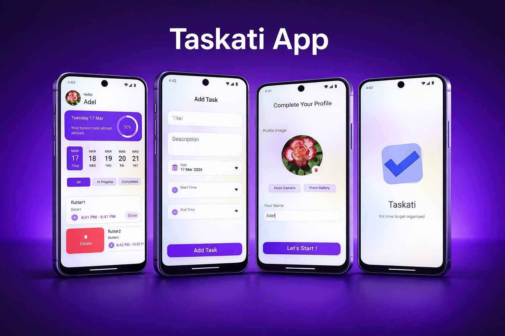

# 📱 Taskati

Taskati is a simple and clean task management application built using Flutter.
The app helps users organize their daily tasks efficiently with a modern UI and smooth user experience.

---

## 🚀 Features

* Add and manage daily tasks
* Set task date, start time, and end time
* Track task progress (Completed / In Progress)
* Local storage using Hive
* Save user name and profile image using SharedPreferences
* Clean and modern UI design

---

## 🧠 State Management

* Implemented using **Cubit (Bloc)**
* Separated business logic from UI
* Scalable architecture for future features

---

## 🛠 Tech Stack

* Flutter
* Dart
* Hive (Local Database)
* SharedPreferences
* Flutter Bloc (Cubit)

---

## 📦 Versions

### 🟢 Version 0.1.0 — Initial Release

* Built core app structure
* Added Splash screen
* Implemented user setup (name + image)
* Added Hive for task storage
* Basic task features (Add / View)

### 🔧 Version 0.1.1 — Bug Fix

* Fixed issue where user had to re-enter name and image on every app launch
* Improved app flow using cached data

### 🔵 Version 0.2.0 — UI & Architecture Upgrade

* Refactored color system
* Improved Add Task UI and text
* Enhanced buttons and inputs
* Implemented Cubit (Bloc) for Home screen
* Added AppCubit and AppState
* Separated logic from UI
* Updated dependencies

---

## 📌 Future Improvements

* Notifications for task start and end
* Edit and delete tasks using Cubit
* Dark mode support
* API integration

---

## 👨‍💻 Developer

Adel Khaled
Flutter Developer 🚀

## 📸 Screenshots

